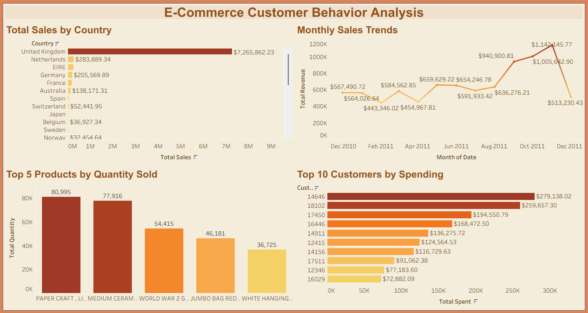

# E-Commerce Customer Behavior Analysis
Third portfolio project analyzing e-commerce data with SQL and Tableau.

## Overview
- **SQL**: Imported a cleaned retail dataset (396,093 rows) into MySQL using the Table Data Import Wizard, created queries for sales by country, top products, monthly trends and top customers.
- **Tableau**: Visualized results with horizontal bar charts (sales by country, top customers), a vertical bar chart (top products) and a line chart (monthly sales trends).
- **Files**:
  - ecommerce_behavior.sql: SQL script for database setup and queries.
  - CSVs: Query results.
  - Tableau Public: [[Insert Tableau Public URL](https://public.tableau.com/app/profile/vishal.d.silva/viz/Ecommerce_Behavior/E-CommerceCustomerBehaviorAnalysis)]
- **Tools**: MySQL Workbench, Tableau Public

## Visualizations
- **Sales by Country**: Horizontal bar chart of total sales per country.
- **Top 5 Products**: Vertical bar chart of top products by quantity sold.
- **Monthly Sales Trends**: Line chart of revenue over time.
- **Top Customers**: Horizontal bar chart of top 10 customers by spending.

## Screenshots

